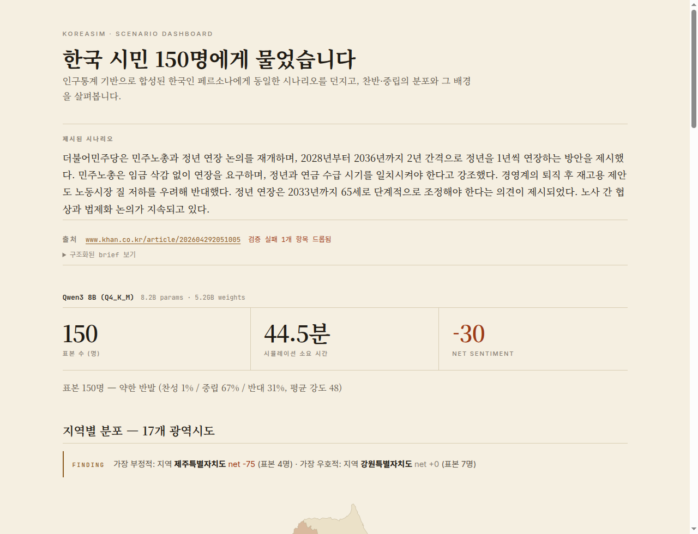

<div align="center">

# 🇰🇷 KoreaSim

### 인구통계 기반 한국 사회 시뮬레이터 · 오픈 가중치 8B LLM · 노트북 한 대

[](https://www.python.org/)
[](LICENSE)
[](https://huggingface.co/datasets/nvidia/Nemotron-Personas-Korea)
[](https://github.com/winhun98/koreasim/actions/workflows/ci.yml)

*"한국은 X에 대해 실제로 어떻게 생각할까?"*

[빠른 시작](#-빠른-시작) · [실제 결과](#-실제-결과--한국-뉴스-기사-2026-04-2930) · [작동 원리](#-작동-원리) · [로드맵](#-로드맵)

🌐 **[English README](README.md)** · **[Live dashboards (GitHub Pages)](https://winhun98.github.io/koreasim/examples/runs/)**

</div>

<a href="https://winhun98.github.io/koreasim/examples/runs/khan-co-kr-202604292051005.html">
  
</a>

<div align="center"><sub>↑ 샘플 dashboard — <a href="https://www.khan.co.kr/article/202604292051005">"당정 '65세 단계적 정년 연장' 재추진" (경향신문)</a> · 150명 페르소나 · 클릭하면 인터랙티브 dashboard</sub></div>

---

## 이게 뭔가요?

인구통계적으로 정확하게 합성된 한국인 단면이 어떤 정책 · 시장 충격 · 뉴스에 어떻게
반응할지를 노트북 한 대로 시뮬레이션하는 도구입니다.

**문장을 하나 던지거나** (예: `"코스피 -8%, 서킷브레이커 발동"`) **실제 한국 뉴스
기사 URL을 그대로** 던지면 (기사를 fetch해서 LLM이 verbatim-quote 가드와 함께
구조화된 brief로 요약 후 시나리오로 사용), **N명의 한국인 에이전트**를 병렬로 돌려
— 각각 실제 인구통계 데이터 기반 — 다음을 돌려줍니다:

- 🇰🇷 17개 광역시도별 net sentiment 한국 지도
- 🧑‍🤝‍🧑 400개 emoji 페르소나 wall (avatar 클릭 시 그 사람의 reasoning 전문)
- 📊 연령 / 지역 / 직업 / 소득 / 정치성향별 demographic 분해
- 🖼 X/OG용 1200×630 social card PNG 자동 생성
- 📰 *(URL 모드)* dashboard 출처 attribution 박스 — 구조화 brief 슬롯(행위자 · 조치 · 규모 · 대상 · 시점 · 범위)과 verbatim 검증된 숫자/인용으로, 모든 결과를 원문까지 역추적 가능

| | |
|---|---|
| **페르소나 출처** | [Nemotron-Personas-Korea](https://huggingface.co/datasets/nvidia/Nemotron-Personas-Korea) — 700만 합성 한국인. KOSIS 인구센서스 + 대법원 성명 분포 + NHIS 건강 기록 기반 (NVIDIA, 2026년 4월) |
| **기본 모델** | [Qwen3 8B Q4_K_M](https://ollama.com/library/qwen3:8b) (Ollama) — 5.2GB, 한국어 출력 강함. 1.58-bit BitNet 프리셋(`bitnet-2b`, `llama3-8b`)도 옵션 — [모델 프리셋](#-모델-프리셋) 참조. |
| **실행 위치** | 로컬 노트북 + Ollama. 외부 API 호출 없음, per-call 비용 없음. |
| **처리량 (100명 기준)** | 16-core CPU + GPU + Ollama 환경에서 약 14분 |

---

## ⚡ 빠른 시작

```bash
# 사전 준비: Ollama + qwen3:8b
#   curl -fsSL https://ollama.com/install.sh | sh
#   ollama pull qwen3:8b

git clone https://github.com/winhun98/koreasim.git
cd koreasim
pip install -e ".[viz]"

# 내장 시나리오 실행
koreasim run kospi_crash --n 100

# 또는 — 실제 한국 뉴스 URL을 그대로 (권장)
koreasim run --url "https://www.yna.co.kr/view/AKR20260430037300003" --n 100
```

`--url` 모드는 기사를 fetch한 뒤 [`trafilatura`](https://trafilatura.readthedocs.io/)로
본문을 추출하고, Qwen3 8B로 구조화된 brief(행위자 · 조치 · 규모 · 대상 · 시점 · 범위
+ 핵심 인용)를 생성합니다. **Verbatim 가드**가 원문에 등장하지 않는 숫자나 인용문을
자동으로 걸러내고, brief의 summary를 시나리오로 사용해 N명의 페르소나를 돌립니다.
출처 URL과 구조화된 brief 슬롯이 dashboard 헤더에 박혀, 모든 결과를 원문까지
역추적할 수 있습니다.

각 실행은 `results/`에 다음 **4개 파일**을 만듭니다:

| 파일 | 설명 |
|---|---|
| `<slug>.html` | 인터랙티브 dashboard — 한국 지도 · emoji wall · demographic bar · brief 박스 |
| `<slug>.card.png` | 1200×630 social card — X / OG 게시용 |
| `<slug>.summary.json` | demographic 분해 (지역 · 연령 · 직업 · 정치성향) |
| `<slug>.json` | per-persona reaction 전체 + source URL + brief (downstream 분석용) |

LLM 서버 없이 오프라인 템플릿 데모만 보고 싶으면: `koreasim demo --n 300 --mock`.

---

## 📊 실제 결과 — 한국 뉴스 기사 (2026-04-29~30)

2026-04-29~30 사이의 한국 뉴스 기사 4건을 `--url` 모드로 통과시켰습니다. 각각
N=150~200명의 인구통계 기반 한국인 페르소나가 Qwen3 8B Q4_K_M (Ollama)으로 반응.
8GB GPU 한 장에서 총 약 140분, 외부 API 호출 없음.

<a href="https://winhun98.github.io/koreasim/examples/runs/khan-co-kr-202604292051005.html">
  
</a>

| 기사 | 매체 | N | 찬/중/반 | 강도 | 분기 패턴 |
|---|---|---:|---|---:|---|
| **65세 단계적 정년 연장 재추진** ([🌐 dashboard](https://winhun98.github.io/koreasim/examples/runs/khan-co-kr-202604292051005.html) · [json](examples/runs/khan-co-kr-202604292051005.json)) | 경향신문 | 150 | 1 / 67 / **31** | 48 | **40-50대 노동자 강력 반대** (임금삭감 · 경영부담) |
| 서울 아파트 매매가 20% 하락 (양도세 종료) ([🌐 dashboard](https://winhun98.github.io/koreasim/examples/runs/yna-co-kr-AKR20260430037300003.html) · [json](examples/runs/yna-co-kr-AKR20260430037300003.json)) | 연합뉴스 | 200 | 6 / 88 / 6 | 39 | 40대 매수자 ↔ 60-70대 자산보유자 |
| AI 의료 진단·처방 (취약지 공백 해소) ([🌐 dashboard](https://winhun98.github.io/koreasim/examples/runs/yna-co-kr-AKR20260429166500530.html) · [json](examples/runs/yna-co-kr-AKR20260429166500530.json)) | 연합뉴스 | 150 | **91** / 8 / 0 | 57 | 사회 합의 + 노년 디지털 디바이드 |
| 아동복지법 '혼외자' 표현 삭제 ([🌐 dashboard](https://winhun98.github.io/koreasim/examples/runs/yna-co-kr-AKR20260429064600530.html) · [json](examples/runs/yna-co-kr-AKR20260429064600530.json)) | 연합뉴스 | 150 | **89** / 10 / 0 | 57 | 사회 합의 + 70대+ 직접 stake 부재 |

> 💡 **4개 시나리오 각각이 distinct한 demographic 분기 패턴을 만들어냈습니다.**
> "사회적으로 명백히 긍정적인 정책"(AI 의료 · 혼외자 표현)과 "양극 분기"
> (부동산: 매수자 vs 자산보유자)와 "직접 수혜자가 거꾸로 반대"(정년 연장: 50대
> 70% 반대, `6/14`)가 뚜렷이 분리되어 나옵니다. 정년 연장이 가장 흥미로운데,
> 50대가 직접 수혜자인데도 반대하는 이유는 기사가 노동계의 "임금 삭감 안 돼"
> + 경영계의 "재고용" 논쟁 프레임으로 다뤘기 때문입니다. 시뮬레이션이 단순
> "오래 일하면 좋다"는 prior 대신 그 framing 자체를 잡아냅니다.

### 시뮬레이션에서 나온 reasoning 예시 (verbatim)

> [56세 · 경기 · 소상공인] **정년 연장 반대 85**
> 노동비용 부담... 65세까지 일해야 하는 상황은 경영에 압박을 줄 수 있습니다. 퇴직 후 재고용 제안도 노동시장의 불안을 야기.

> [46세 · 대구 · 변호사] **정년 연장 반대 85**
> 변호사로서 기업 고객의 노동비용 부담 증가에 우려하며, 개인적으로 46세로 2033년 65세 정년 도달 시 경력 단절 우려가 크다.

> [76세 · 서울 · 퇴직자] **부동산 반대 75**
> 전세 보증금이 5.6% 오르면서 월세 부담이 늘어나... 친구들이 집을 팔아 전세로 이사하는 걸 보면 경제적 압박이 큰 것 같아요.

> [49세 · 인천 · 변호사] **부동산 찬성 85**
> 변호사로서 법무 관련 부동산 거래에 유리한 환경을 조성할 수 있습니다.

> [73세 · 대구 · 퇴직자] **AI 의료 중립 50**
> AI 의료 도입은 진단 효율화에 도움될 수 있지만, 노인들 like me는 기술 익숙도 부족으로 오히려 혼란을 겪을 수 있어 걱정스럽다.

> [19세 · 충남 · 학생] **혼외자 표현 삭제 찬성 80**
> 혼외자라는 용어가 사라지면 사회적 차별이 줄어들고, 모두가 같은 시선으로 바라받을 수 있다고 생각해요.

각 페르소나의 reasoning은 **직업 × 연령 × 지역**에 정확히 grounded됩니다 — 변호사는
부동산 변동을 법무 거래로, 퇴직자는 임대료 부담으로, 소상공인은 인건비로. 페르소나의
`narrative`(Nemotron-Personas-Korea의 Gemma 생성 한국어 back-story)가 시스템
프롬프트에 verbatim 들어가서, reasoning이 일반론으로 흐르지 않습니다.

### 샘플링 전략 (왜 "전부 중립"이 안 나오는가)

Qwen3 8B의 RLHF 학습은 불확실할 때 "중립"으로 수렴하는 편향이 있습니다. 기본
설정으로 같은 시나리오를 돌리면 **평균 중립 64%** — 정보가 거의 없는 결과입니다.
KoreaSim은 세 층의 mitigation으로 실제 의견 분포를 회복합니다:

1. **`min_p=0.03` + `temperature=0.9`** — 무난한 중립을 만드는 중간 확률 토큰을 컷
2. **Stake-elicitation 프롬프트** — 페르소나가 자기 신원(나이/지역/직업/소득)에
   비춰 답하도록 명시하고, "회피용 중립"을 명시적으로 금지("영향이 있는데 의견이
   양가적이면 더 강하게 느끼는 쪽 선택")
3. **Rejection sampling** — empty 응답(약 14%, 어려운 demographic × stake 조합)이
   나오면 단순 fallback 프롬프트로 재시도. 최종 empty rate **0%**

튜닝 후: **평균 중립 64% → 51%, 평균 강도 41 → 52, empty rate 0%**.
실험 로그는 [`docs/SAMPLING.md`](docs/SAMPLING.md) 참조.

---

## 🖼 결과물

### 1. 자동 생성 social card

다크 테마 단일 PNG, 1200×630 (X 카드 규격). 표본 수와 net 점수 헤드라인이 트윗
썸네일 역할을 단독으로 수행합니다.

### 2. 인터랙티브 dashboard

`results/{slug}.html` — single self-contained 파일. 5개 섹션:

1. **Hero stats** — `100 agents · 14min · net -43`
2. **한국 광역시도 지도** — 17개 도, 색상 = net sentiment, hover 시 표본 정보
3. **People wall** — 지역/연령 stratified emoji avatar. 클릭 시 그 페르소나의 reasoning 전문
4. **Demographic bars** — 연령 / 지역 / 직업 / 정치성향별 sentiment 분포 stacked bar
5. **그룹별 대표 quote** — bucket별로 강도가 가장 높은 reasoning 인용

`--url` 모드일 때는 헤더에 **출처 attribution 박스**(원문 URL + 구조화된 brief
슬롯 + verbatim 검증 결과 경고)가 추가됩니다.

### 3. Aggregate JSON (downstream 분석용)

`{slug}.summary.json` — 모든 demographic 그룹별 N · sentiment % · net 점수 · 평균
강도 · 대표 quote. pandas / ggplot / Streamlit 등 어디든 바로 import. 약 30KB.

---

## 🧠 작동 원리

```
                 ┌──────────────────────────────────────────┐
                 │  Nemotron-Personas-Korea (700만 합성)    │
                 │  region · age · occupation · narrative   │
                 └────────────────┬─────────────────────────┘
                                  │  PersonaLoader (filter / stratify)
                                  ▼
              ┌──────────────────────────────────────────────┐
              │  N개 KoreanPersona → 한국어 system prompt      │
              │  (narrative가 verbatim으로 들어감)              │
              └──────────────────────────────────────────────┘
                                  │
                                  ▼
       ┌─────────────────────────────────────────────────────────────┐
       │   Qwen3 8B Q4_K_M (Ollama 기본)                              │
       │   ←  asyncio.gather × N_parallel  ←  ScenarioRunner           │
       │   또는: BitNet 1.58-bit, vLLM, NIM, OpenAI — chat-completions │
       └─────────────────────────────────────────────────────────────┘
                                  │  per-persona JSON reaction
                                  ▼
   ┌────────────┬────────────┬─────────────┬─────────────┬────────────┐
   │  Korea map │  emoji wall│  age/region │  occupation │  political │
   └────────────┴────────────┴─────────────┴─────────────┴────────────┘
                                  │
                                  ▼
                ┌───────────────────────────────────────────┐
                │   HTML dashboard + social PNG + JSON      │
                └───────────────────────────────────────────┘
```

페르소나의 reaction은 system prompt + 시나리오 → **JSON**:

```json
{
  "sentiment": "supportive | neutral | opposed",
  "intensity": 0-100,
  "reasoning": "한 두 문장으로 본인 입장에서의 이유"
}
```

페르소나의 `narrative`(Nemotron-Personas-Korea의 Gemma 생성 한국어 back-story)가
**문화적** grounding, 구조화 필드(지역/연령/직업)가 **통계적** grounding입니다.
KoreaSim은 이 데이터를 재가공하지 않고 ground truth로 그대로 사용합니다.

런타임 파이프라인은 robust합니다. 파서는 멀티라인 JSON, ` ```json ` 펜스,
중간 truncation을 모두 처리하며 키워드 sentiment fallback도 있습니다. Rejection
sampling 활성화 시(기본) Qwen3 8B의 empty 응답률은 **0%**까지 떨어집니다.

---

## 📦 내장 시나리오

```bash
koreasim list-scenarios
```

| Key | Stimulus |
|-----|----------|
| `pension_age` | 국민연금 수령 개시 연령 65→68 상향 |
| `housing_price` | 수도권 아파트 평균 20% 추가 상승 전망 |
| `kospi_crash` | 코스피 -8% + 서킷브레이커 발동 |
| `minimum_wage` | 최저시급 12,000원 (약 +20%) 인상 |
| `ai_replacement` | 5년 내 사무직 30% AI 자동화 보고서 |

또는 **자유 한국어 문장**을 그대로 CLI에 전달:

```bash
koreasim run "갑자기 폭설이 내려 출퇴근이 마비되었습니다" --n 100
```

또는 **실제 한국 뉴스 URL**을 — Qwen3 8B가 verbatim 가드와 함께 구조화된 brief로
요약한 후 시나리오로 사용합니다:

```bash
koreasim run --url "https://www.yna.co.kr/view/AKR20260430037300003" --n 200
koreasim run --url "https://www.khan.co.kr/article/202604292051005" --n 150
```

URL 모드 dashboard에는 **출처 attribution 박스**(원문 URL · 구조화 brief 슬롯 ·
verbatim 검증 실패 항목 경고)가 헤더에 추가됩니다.

---

## 🤖 모델 프리셋

```bash
koreasim list-models
```

| Preset | Model | Params | Size | 비고 |
|---|---|---:|---:|---|
| **`qwen3-8b`** (기본) | qwen3:8b (Q4_K_M, Ollama) | 8.2B | 5.2GB | 한국어 강함. 노트북 데모 권장. |
| `llama3.1-8b` | llama3.1:latest (Q4_K_M, Ollama) | 8.0B | 4.9GB | 영어 편향 — 한국어 약함. |
| `bitnet-2b` | microsoft/bitnet-b1.58-2B-4T | 2.0B | 0.4GB | 진짜 1.58-bit. **AVX_VNNI / Apple Silicon NEON** 환경 + bitnet.cpp 필요. |
| `bitnet-3b` | 1bitLLM/bitnet_b1_58-3B | 3.0B | 0.6GB | 커뮤니티 1.58-bit 재구현. |
| `llama3-8b` | HF1BitLLM/Llama3-8B-1.58-100B-tokens | 8.0B | 1.6GB | 가장 큰 1.58-bit 변종. |

> ⚠️ **1.58-bit BitNet 주의**: 런타임 이득은 BitNet의 int8 dot-product 커널에서
> 나오는데, AVX_VNNI(Intel Sapphire Rapids+, AMD Zen 5+) 또는 Apple Silicon
> NEON에서만 빠릅니다. 일반 AVX2 하드웨어에서는 BitNet i2_s가 느린 software
> 경로(8B 기준 ~0.1 tok/s)로 떨어져 "노트북에서 돈다"는 약속이 깨집니다. 그래서
> 지원 하드웨어 사용자만 BitNet을 opt-in으로 쓰고, 기본은 Qwen3 8B Q4_K_M으로 —
> Ollama만 깔려있으면 **어느 최신 노트북에서도** 강한 한국어 출력이 나옵니다.

CLI에서 override:

```bash
koreasim run kospi_crash --n 100 --model bitnet-2b --llm-url http://127.0.0.1:8081
```

또는 명시적인 HuggingFace / Ollama id를 그대로:

```bash
koreasim run kospi_crash --model qwen2.5:14b --n 100
```

---

## 🐍 라이브러리 API

```python
import asyncio
from koreasim.persona.loader import PersonaLoader
from koreasim.llm.backend import LLMConfig, OpenAICompatibleBackend
from koreasim.scenario.runner import ScenarioRunner
from koreasim.analysis.aggregate import aggregate_by, summarize
from koreasim.analysis.compute import receipt_for_run
from koreasim.viz.dashboard import build_dashboard
from koreasim.viz.social_card import build_social_card

async def main():
    # 오프라인 sample (extra dep 불필요). 7M HuggingFace dataset 쓰려면:
    #   pip install -e ".[data]"
    #   PersonaLoader.from_huggingface(count=2_000)
    personas = (
        PersonaLoader.sample(count=2_000, seed=42)
        .filter(age_min=20, age_max=39, regions=["서울특별시", "경기도"])
        .stratified_sample(500, by="occupation_group")
    )

    backend = OpenAICompatibleBackend(LLMConfig(
        base_url="http://127.0.0.1:11434",   # Ollama
        model="qwen3:8b",
        # 기본값 (Qwen3 neutral 편향 깨도록 튜닝됨):
        # temperature=0.9, top_p=0.95, min_p=0.03, max_tokens=800, n_parallel=4
    ))
    await backend.start()
    try:
        runner = ScenarioRunner(backend, max_tokens=800, temperature=0.9)
        result = await runner.run(personas, "kospi_crash")
    finally:
        await backend.stop()

    receipt = receipt_for_run(result.n, result.elapsed_s)
    print(f"{result.n:,} agents in {result.elapsed_s:.1f}s "
          f"({receipt.agents_per_sec:.0f} agents/sec)")
    print(summarize(result).headline)

    build_dashboard(result, "results/kospi.html", receipt=receipt)
    build_social_card(result, "results/kospi.card.png", receipt=receipt)

asyncio.run(main())
```

---

## ⚖ "그냥 LLM에 프롬프팅"과의 차이

| 단순 접근 | KoreaSim |
|-----|-----|
| LLM 1대 + 일반 페르소나 1개 | **실제 인구센서스 분포에 grounded된 N명 페르소나** |
| 영어 중심 기본값 | 한국 이름 · 지역 · 정치성향 분포 |
| "한국인은 보통…" | 세그먼트별 heat map + 반대 의견 quote |
| 호스티드 API 의존 | **로컬 8B Q4 + Ollama — 노트북 오프라인 동작** |
| Black-box 의견 | 페르소나 `narrative`가 prompt에 그대로 → **완전 audit 가능** |

**솔직한 disclaimer.** 이건 실제 여론조사 대체재가 *아닙니다*. 페르소나는 합성이고,
LLM reaction은 모델이 그 demographic 사람이 *어떻게 말할 것 같은지*에 대한 prior일
뿐입니다. 가설 생성, 정책 제안 red-teaming, 사회학적 tabletop exercise 용도로
사용하세요 — 언론 헤드라인용 X.

**경험적으로 알려진 한계:**
- Qwen3 8B는 RLHF로 "중립" 편향이 baseline. KoreaSim의 `min_p=0.03` + stake-
  elicitation prompt + rejection sampling으로 평균 중립을 64%→51%까지 낮추지만
  ([`docs/SAMPLING.md`](docs/SAMPLING.md) 참조), 남은 51%에는 합리적 중립도 포함됩니다
  (예: 비수도권 페르소나의 housing_price 시나리오).
- Reasoning 길이는 `max_tokens`로 bounded — 기본 800 토큰에서 약 10%가 문장 중간
  truncation (파서가 brace-counting + regex로 최대한 살림).
- BitNet 1.58-bit weights는 AVX_VNNI / Apple Silicon에서만 빠름 — [모델 프리셋](#-모델-프리셋) 참조.

---

## 🛣 로드맵

- [x] Persona loader + filtering + stratified sampling
- [x] Ollama / OpenAI-compatible backend (Qwen3 8B 기본)
- [x] BitNet 1.58-bit 프리셋 (Apple Silicon에서 best)
- [x] ScenarioRunner — async 병렬 generation, robust JSON 파서
- [x] Demographic aggregation (연령 / 지역 / 직업 / 소득 / 정치성향)
- [x] **한국 광역시도 지도** (17개 도, 색 = net sentiment)
- [x] **Emoji 페르소나 wall** (직업·연령 emoji, 클릭 → 개인 reasoning)
- [x] **Social card PNG 자동 생성** (1200×630 for X / OG)
- [x] **Compute receipt** (agents/sec · token throughput)
- [x] CLI + 5개 내장 시나리오
- [x] **`--url` 모드** (실제 뉴스 기사 → 구조화 brief → 시뮬레이션)
- [x] **Verbatim guard** (LLM 할루시네이션 차단)
- [ ] 한국 지도 choropleth (광역시도 polygon)
- [ ] **페르소나 ↔ 페르소나 dialogue** — 단순 reaction 아니라 토론
- [ ] **Multi-round** 시나리오 — 초기 reaction → 후속 뉴스 → 입장 업데이트
- [ ] BitJury 통합 — 페르소나당 N-model voting으로 분산 감소
- [ ] 실제 여론조사 (KSOI, 한국갤럽) 대비 공개 벤치마크

---

## 🙏 출처

- **페르소나:** [NVIDIA Nemotron-Personas-Korea](https://huggingface.co/datasets/nvidia/Nemotron-Personas-Korea) (CC BY 4.0)
- **기본 모델:** [Qwen3 8B](https://ollama.com/library/qwen3:8b) (Apache 2.0) via [Ollama](https://ollama.com/)
- **선택 모델:** [Microsoft BitNet b1.58](https://github.com/microsoft/BitNet) (MIT), [Llama3.1](https://github.com/meta-llama/llama-models) (Llama 3 Community)
- **영감:** [bitfish](https://github.com/winhun98/bitfish) (BitNet 기반 시장 시뮬) — async backend와 Persona 패턴이 여기로 이어졌습니다.

## 📄 라이선스

Apache 2.0 — [LICENSE](LICENSE) 참조. 페르소나 데이터는 Nemotron-Personas-Korea의
CC BY 4.0을 상속.

---

<div align="center">
<sub>KoreaSim이 아이디어를 자극했다면, ⭐ 부탁드리고 시나리오를 <a href="https://twitter.com/intent/tweet?text=I%20simulated%20Korea's%20reaction%20to%20...%20with%20%40KoreaSim%20%F0%9F%87%B0%F0%9F%87%B7&url=https://github.com/winhun98/koreasim">#KoreaSim</a>에 트윗해주세요.</sub>
</div>
