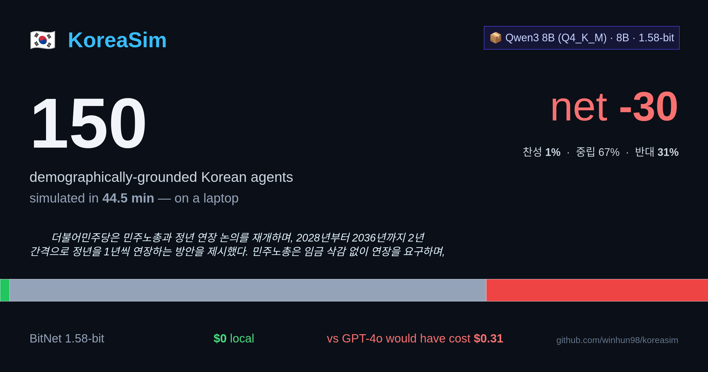

<div align="center">

# 🇰🇷 KoreaSim

### Demographically-grounded Korean society simulator · Open-weight 8B LLM · Laptop-class

[](https://www.python.org/)
[](LICENSE)
[](https://huggingface.co/datasets/nvidia/Nemotron-Personas-Korea)
[](https://github.com/winhun98/koreasim/actions/workflows/ci.yml)

*"What does Korea actually think about X?"*

[Quickstart](#-quickstart) · [Live results](#-live-results) · [How it works](#-how-it-works) · [Roadmap](#-roadmap)

</div>

---

## What is this?

A laptop-scale simulator of how a demographically-accurate slice of Korean society reacts
to any policy, market shock, or news event.

You give it a sentence ("코스피 -8%, 서킷브레이커 발동"). It runs **N Korean
agents** through it in parallel — each one grounded in real census data — and returns:

- 🇰🇷 South Korea bubble map of net sentiment by 광역시도
- 🧑‍🤝‍🧑 400-emoji wall of individual reactions (click any avatar to read what they thought)
- 📊 Demographic breakdowns by age / region / occupation / income / political lean
- 🖼 1200×630 social card PNG auto-generated for X

| | |
|---|---|
| **Persona source** | [Nemotron-Personas-Korea](https://huggingface.co/datasets/nvidia/Nemotron-Personas-Korea) — 7M synthetic Koreans grounded in KOSIS census, Supreme Court name distributions, NHIS health records (NVIDIA, April 2026) |
| **Default model** | [Qwen3 8B Q4_K_M](https://ollama.com/library/qwen3:8b) via Ollama — 5.2GB, strong Korean output. Optional 1.58-bit BitNet presets (`bitnet-2b`, `llama3-8b`) — see [Model presets](#-model-presets). |
| **Cost vs GPT-4o** | **$0** vs ~$0.21 per 100-agent run |
| **Throughput (100 agents)** | ~14 min on a 16-core CPU + GPU via Ollama |

---

## ⚡ Quickstart

```bash
# Prerequisite: Ollama with qwen3:8b
#   curl -fsSL https://ollama.com/install.sh | sh
#   ollama pull qwen3:8b

git clone https://github.com/winhun98/koreasim.git
cd koreasim
pip install -e ".[viz]"

# Built-in scenario
koreasim run kospi_crash --n 100

# OR — feed a real Korean news article URL (recommended)
koreasim run --url "https://www.yna.co.kr/view/AKR20260430037300003" --n 100
```

`--url` mode fetches the article, extracts clean body text via
[`trafilatura`](https://trafilatura.readthedocs.io/), generates a structured
brief (행위자 · 조치 · 규모 · 대상 · 시점 · 범위 + key quotes) via Qwen3 8B with
a **verbatim guard** that rejects any number or quote not appearing in the
source, then runs N personas against the brief's summary. Source URL and
structured brief slots are rendered into the dashboard header so every result
is traceable back to the original article.

You get **4 artifacts** per run in `results/`:

| File | What it is |
|---|---|
| `<slug>.html` | Interactive dashboard — Korea map · emoji wall · demographic bars · brief box |
| `<slug>.card.png` | 1200×630 social card — drop into your X / OG post |
| `<slug>.summary.json` | Demographic breakdowns (region · age · occupation · political lean) |
| `<slug>.json` | Raw per-persona reactions + source URL + brief for downstream analysis |

For an offline templated demo with no LLM server: `koreasim demo --n 300 --mock`.

---

## 📊 Live results — Real Korean news (2026-04-29~30)

Four 2026-04-29~30 Korean news articles, each piped through `--url` mode and
simulated against N=150–200 demographically-grounded Korean personas with
Qwen3 8B Q4_K_M via Ollama. Total compute time: ~140 minutes on a single 8 GB
GPU — locally **free**.

<a href="examples/runs/khan-co-kr-202604292051005.html">
  
</a>

| 기사 | 매체 | N | 찬/중/반 | 강도 | 분기 패턴 |
|---|---|---:|---|---:|---|
| **65세 단계적 정년 연장 재추진** ([dashboard](examples/runs/khan-co-kr-202604292051005.html) · [json](examples/runs/khan-co-kr-202604292051005.json)) | 경향신문 | 150 | 1 / 67 / **31** | 48 | **40-50대 노동자 강력 반대** (임금삭감·경영부담) |
| 서울 아파트 매매가 20% 하락 (양도세 종료) ([dashboard](examples/runs/yna-co-kr-AKR20260430037300003.html) · [json](examples/runs/yna-co-kr-AKR20260430037300003.json)) | 연합뉴스 | 200 | 6 / 88 / 6 | 39 | 40대 매수자 ↔ 60-70대 자산보유자 |
| AI 의료 진단·처방 (취약지 공백) ([dashboard](examples/runs/yna-co-kr-AKR20260429166500530.html) · [json](examples/runs/yna-co-kr-AKR20260429166500530.json)) | 연합뉴스 | 150 | **91** / 8 / 0 | 57 | 사회 합의 + 노년 디지털 디바이드 |
| 아동복지법 '혼외자' 표현 삭제 ([dashboard](examples/runs/yna-co-kr-AKR20260429064600530.html) · [json](examples/runs/yna-co-kr-AKR20260429064600530.json)) | 연합뉴스 | 150 | **89** / 10 / 0 | 57 | 사회 합의 + 70대+ 직접 stake 부재 |

> 💡 **Each of the four scenarios produced a distinct demographic split — the
> simulator separates "manifestly positive policy" (AI 의료·혼외자 표현) from
> "양극 분기" (부동산 매수자 vs 자산보유자) from "직접 수혜자가 거꾸로 반대"
> (정년 연장: 50대 70% 반대, `6/14`).** The 정년 연장 case is the most
> interesting — even though 50대 are the direct beneficiaries of an extended
> retirement age, they reject the proposal because the article frames it
> through 노동계의 "임금 삭감 안 돼" + 경영계의 "재고용" debate. The simulation
> picks up that framing rather than the naive "more years of pay = better" prior.

### Sample reasoning — verbatim from the simulation

> [56세 · 경기 · 소상공인] **정년 연장 반대 85**
> 노동비용 부담... 65세까지 일해야 하는 상황은 경영에 압박을 줄 수 있습니다. 퇴직 후 재고용 제안도 노동시장의 불안을 야기.

> [46세 · 대구 · 변호사] **정년 연장 반대 85**
> 변호사로서 기업 고객의 노동비용 부담 증가에 우려하며, 개인적으로 46세로 2033년 65세 정년 도달 시 경력 단절 우려가 크다.

> [76세 · 서울 · 퇴직자] **부동산 반대 75**
> 전세 보증금이 5.6% 오르면서 월세 부담이 늘어나... 친구들이 집을 팔아 전세로 이사하는 걸 보면 경제적 압박이 큰 것 같아요.

> [49세 · 인천 · 변호사] **부동산 찬성 85**
> 변호사로서 법무 관련 부동산 거래에 유리한 환경을 조성할 수 있습니다.

> [73세 · 대구 · 퇴직자] **AI 의료 중립 50**
> AI 의료 도입은 진단 효율화에 도움될 수 있지만, 노인들 like me는 기술 익숙도 부족으로 오히려 혼란을 겪을 수 있어 걱정스럽다.

> [19세 · 충남 · 학생] **혼외자 표현 삭제 찬성 80**
> 혼외자라는 용어가 사라지면 사회적 차별이 줄어들고, 모두가 같은 시선으로 바라받을 수 있다고 생각해요.

Each persona's reasoning is grounded in their **occupation × age × region** —
변호사 sees 부동산 변동을 법무 거래로, 퇴직자 sees 임대료 부담으로, 소상공인 sees
인건비로. The persona's `narrative` (Gemma-generated Korean back-story from
Nemotron-Personas-Korea) drops verbatim into the system prompt so reasoning
isn't generic boilerplate.

### Sampling strategy (why these numbers and not "everyone is neutral")

Qwen3 8B's RLHF training pushes it toward "neutral" responses when uncertain. Out-of-the-box, the same scenarios produce **64% mean neutral** — flat, uninformative. KoreaSim ships with three layers that recover real opinion distributions:

1. **`min_p=0.03` + `temperature=0.9`** — clips the mid-probability "safe" tokens that produce vacuous neutrals.
2. **Stake-elicitation prompt** — asks the persona to ground their answer in their specific 신원 (age/region/occupation/income), and explicitly **forbids escape neutrals** ("영향이 있는데 의견이 양가적이면 더 강하게 느끼는 쪽 선택").
3. **Rejection sampling** — if a persona returns empty content (~14% of the time on the harder demographic-stake combinations), retry with a simpler fallback prompt. Drops empty rate to **0%**.

After tuning: **mean neutral 64% → 51%, mean intensity 41 → 52, empty rate 0%**. See [`docs/SAMPLING.md`](docs/SAMPLING.md) for the experimental log.

---

## 🖼 What comes out

### 1. Auto-generated social card

Single PNG, dark theme, 1200×630 (X card spec). The scale + headline number do the work of a tweet thumbnail by themselves.

### 2. Interactive dashboard

`results/{scenario}.html` — single self-contained file. Five sections:

1. **Hero stats** — `100 agents · 14min · $0 vs $0.21 GPT-4o · net -43`
2. **South Korea bubble map** — 17 광역시도, bubble size = sample N, color = net sentiment, hover for details
3. **Wall of people** — emoji avatars stratified by region/age. Click any avatar → that persona's full reasoning
4. **Demographic bars** — stacked sentiment % by age / region / occupation / political lean
5. **Group quotes** — highest-intensity reasoning per bucket

### 3. Aggregates JSON (for downstream analysis)

`{scenario}.summary.json` — every demographic group with N · sentiment % · net score · average intensity · top reasoning quotes. Bring it into pandas, ggplot, your Streamlit app, whatever. ~30KB.

---

## 🧠 How it works

```
                 ┌──────────────────────────────────────────┐
                 │  Nemotron-Personas-Korea (7M synthetic)  │
                 │  region · age · occupation · narrative   │
                 └────────────────┬─────────────────────────┘
                                  │  PersonaLoader (filter / stratify)
                                  ▼
              ┌──────────────────────────────────────────────┐
              │  N KoreanPersona objects → Korean prompts      │
              │  (narrative drops verbatim into system prompt) │
              └──────────────────────────────────────────────┘
                                  │
                                  ▼
       ┌─────────────────────────────────────────────────────────────┐
       │   Qwen3 8B Q4_K_M (Ollama default)                            │
       │   ←  asyncio.gather × N_parallel  ←  ScenarioRunner            │
       │   Or: BitNet 1.58-bit, vLLM, NIM, OpenAI — any chat-completions │
       └─────────────────────────────────────────────────────────────┘
                                  │  per-persona JSON reactions
                                  ▼
   ┌────────────┬────────────┬─────────────┬─────────────┬────────────┐
   │  Korea map │  emoji wall│  age/region │  occupation │  political │
   └────────────┴────────────┴─────────────┴─────────────┴────────────┘
                                  │
                                  ▼
                ┌───────────────────────────────────────────┐
                │   HTML dashboard + social PNG + JSONs     │
                └───────────────────────────────────────────┘
```

Each persona's reaction is a system-prompt + scenario → **JSON**:

```json
{
  "sentiment": "supportive | neutral | opposed",
  "intensity": 0-100,
  "reasoning": "한 두 문장으로 본인 입장에서의 이유"
}
```

The persona's `narrative` (a Gemma-generated Korean back-story from
Nemotron-Personas-Korea) is the **cultural** grounding. The structured fields
(region/age/occupation) are the **statistical** grounding. KoreaSim doesn't
re-derive any of this — it consumes the dataset as ground truth.

The runtime pipeline is robust: the parser handles multi-line JSON, ```json fences, mid-string truncation, and falls back to keyword-sentiment classification. With rejection sampling enabled (default), the empty-response rate on Qwen3 8B drops to **0%** even on hard prompt × persona combinations.

---

## 📦 Built-in scenarios

```bash
koreasim list-scenarios
```

| Key | Stimulus |
|-----|----------|
| `pension_age` | 국민연금 수령 개시 연령 65→68 상향 |
| `housing_price` | 수도권 아파트 평균 20% 추가 상승 전망 |
| `kospi_crash` | 코스피 -8% + 서킷브레이커 발동 |
| `minimum_wage` | 최저시급 12,000원 (약 +20%) 인상 |
| `ai_replacement` | 5년 내 사무직 30% AI 자동화 보고서 |

Or pass any **free-form Korean sentence** at the CLI:

```bash
koreasim run "갑자기 폭설이 내려 출퇴근이 마비되었습니다" --n 100
```

Or pass a **real Korean news URL** — the article is fetched, summarised into
a structured brief by Qwen3 8B with a verbatim quote/number guard, then used
as the scenario:

```bash
koreasim run --url "https://www.yna.co.kr/view/AKR20260430037300003" --n 200
koreasim run --url "https://www.khan.co.kr/article/202604292051005" --n 150
```

The dashboard for URL-mode runs includes a **source attribution box** with
the original URL, the structured brief slots (행위자 · 조치 · 규모 · ...), and
a warning if any item failed the verbatim check (always 0 in the four runs
shown in [Live results](#-live-results-real-korean-news-2026-04-2930)).

---

## 🤖 Model presets

```bash
koreasim list-models
```

| Preset | Model | Params | Size | Notes |
|---|---|---:|---:|---|
| **`qwen3-8b`** (default) | qwen3:8b (Q4_K_M, Ollama) | 8.2B | 5.2GB | Strong Korean. Recommended for laptop demos. |
| `llama3.1-8b` | llama3.1:latest (Q4_K_M, Ollama) | 8.0B | 4.9GB | English-leaning; weaker Korean. |
| `bitnet-2b` | microsoft/bitnet-b1.58-2B-4T | 2.0B | 0.4GB | True 1.58-bit. Requires bitnet.cpp + CPU with **AVX_VNNI / Apple Silicon NEON** for usable throughput. |
| `bitnet-3b` | 1bitLLM/bitnet_b1_58-3B | 3.0B | 0.6GB | Community 1.58-bit reproduction. |
| `llama3-8b` | HF1BitLLM/Llama3-8B-1.58-100B-tokens | 8.0B | 1.6GB | Largest 1.58-bit variant. |

> ⚠️ **About 1.58-bit BitNet**: the runtime gain comes from BitNet's int8 dot-product kernels, which are only fast on AVX_VNNI (Intel Sapphire Rapids+, AMD Zen 5+) and Apple Silicon NEON. On plain AVX2 hardware, BitNet i2_s falls back to a slow software path (~0.1 tok/s for 8B), defeating the laptop claim. We've kept the BitNet path as an opt-in for users on supported hardware, and use Qwen3 8B Q4_K_M as the default — it gives strong Korean output on **any** modern laptop with Ollama installed.

Override at the CLI:

```bash
koreasim run kospi_crash --n 100 --model bitnet-2b --llm-url http://127.0.0.1:8081
```

Or pass any explicit HuggingFace / Ollama id directly:

```bash
koreasim run kospi_crash --model qwen2.5:14b --n 100
```

---

## 🐍 Library API

```python
import asyncio
from koreasim.persona.loader import PersonaLoader
from koreasim.llm.backend import LLMConfig, OpenAICompatibleBackend
from koreasim.scenario.runner import ScenarioRunner
from koreasim.analysis.aggregate import aggregate_by, summarize
from koreasim.analysis.compute import receipt_for_run
from koreasim.viz.dashboard import build_dashboard
from koreasim.viz.social_card import build_social_card

async def main():
    # Offline sample (no extras needed). For the full 7M HuggingFace dataset:
    #   pip install -e ".[data]"
    #   PersonaLoader.from_huggingface(count=2_000)
    personas = (
        PersonaLoader.sample(count=2_000, seed=42)
        .filter(age_min=20, age_max=39, regions=["서울특별시", "경기도"])
        .stratified_sample(500, by="occupation_group")
    )

    backend = OpenAICompatibleBackend(LLMConfig(
        base_url="http://127.0.0.1:11434",   # Ollama
        model="qwen3:8b",
        # Defaults (tuned to break Qwen3 neutral bias):
        # temperature=0.9, top_p=0.95, min_p=0.03, max_tokens=800, n_parallel=4
    ))
    await backend.start()
    try:
        runner = ScenarioRunner(backend, max_tokens=800, temperature=0.9)
        result = await runner.run(personas, "kospi_crash")
    finally:
        await backend.stop()

    receipt = receipt_for_run(result.n, result.elapsed_s)
    print(f"💸 GPT-4o equivalent saved: ${receipt.gpt4o_cost_usd:.2f}")
    print(summarize(result).headline)

    build_dashboard(result, "results/kospi.html", receipt=receipt)
    build_social_card(result, "results/kospi.card.png", receipt=receipt)

asyncio.run(main())
```

---

## ⚖ Why this is different from "just prompting an LLM"

| Naïve approach | KoreaSim |
|-----|-----|
| 1 LLM, 1 generic persona | **N personas grounded in real census distributions** |
| English-centric defaults | Korean naming · regional · political distributions |
| "Average Korean thinks…" | Per-segment heat maps + dissenting individual quotes |
| GPT-class API costs ($0.20+ per 100) | **Local 8B Q4 — $0** |
| Black-box opinions | Per-persona `narrative` is in the prompt → **fully auditable** |

**Honest disclaimer.** This is *not* a substitute for actual polling. Personas are synthetic; LLM reactions are *priors* over what a model thinks people in that demographic *might* say. Use it for hypothesis generation, red-teaming policy proposals, sociological tabletop exercises — not for press headlines.

**Empirically-known limitations:**
- Qwen3 8B has a baseline RLHF bias toward "neutral". KoreaSim mitigates this with `min_p=0.03` sampling + a stake-elicitation prompt + rejection sampling on empty responses, dropping mean neutral from 64% → 51% (see [`docs/SAMPLING.md`](docs/SAMPLING.md)). The remaining 51% includes legitimate neutrals — e.g. non-수도권 personas on housing-price scenarios.
- Reasoning length is bounded by `max_tokens` — at the default 800 tokens, ~10% of responses get truncated mid-sentence (the parser salvages what it can via brace-counting + regex repair).
- BitNet 1.58-bit weights only run efficiently on AVX_VNNI / Apple Silicon — see [Model presets](#-model-presets).

---

## 🛣 Roadmap

- [x] Persona loader + filtering + stratified sampling
- [x] Ollama / OpenAI-compatible backend (Qwen3 8B default)
- [x] BitNet 1.58-bit preset (best on Apple Silicon)
- [x] ScenarioRunner — async parallel generation, robust JSON parser
- [x] Demographic aggregation (age / region / occupation / income / political lean)
- [x] **Korea province bubble map** (17 광역시도, color = net sentiment)
- [x] **Emoji-avatar people wall** (직업·연령 emoji, 클릭 → 개인 reasoning)
- [x] **Auto-generated social card PNG** (1200×630 for X / OG)
- [x] **Compute receipt** ($ saved vs GPT-4o)
- [x] CLI + 5 built-in scenarios
- [ ] Choropleth Korea map (province polygons)
- [ ] **Persona ↔ persona dialogue** — let agents argue, not just react
- [ ] **Multi-round** scenarios — initial reaction → follow-up news → updated stance
- [ ] BitJury integration — N-model voting per persona for variance reduction
- [ ] Public benchmark vs. real polls (KSOI, Gallup Korea)

---

## 🙏 Credits

- **Personas:** [NVIDIA Nemotron-Personas-Korea](https://huggingface.co/datasets/nvidia/Nemotron-Personas-Korea) (CC BY 4.0)
- **Default model:** [Qwen3 8B](https://ollama.com/library/qwen3:8b) (Apache 2.0) via [Ollama](https://ollama.com/)
- **Optional models:** [Microsoft BitNet b1.58](https://github.com/microsoft/BitNet) (MIT), [Llama3.1](https://github.com/meta-llama/llama-models) (Llama 3 Community)
- **Inspiration:** [bitfish](https://github.com/winhun98/bitfish) (BitNet-powered market sim) — its async backend & Persona pattern live on here.

## 📄 License

Apache 2.0 — see [LICENSE](LICENSE). Persona data inherits Nemotron-Personas-Korea's CC BY 4.0.

---

<div align="center">
<sub>If KoreaSim sparked an idea, ⭐ the repo and tweet your scenario at <a href="https://twitter.com/intent/tweet?text=I%20simulated%20Korea's%20reaction%20to%20...%20with%20%40KoreaSim%20%F0%9F%87%B0%F0%9F%87%B7&url=https://github.com/winhun98/koreasim">#KoreaSim</a>.</sub>
</div>
